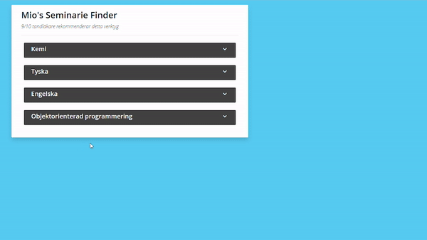

# Webbapplikationer-Kurs
### Projektet
Projektet kallas för "Mio's Seminarie Finder" i väntan på ett bättre namn.  
Projektet bygger på en stabil bas av [jQuery](https://jquery.com/) och [Bootstrap](https://getbootstrap.com/).

### Dynamik
Hemsidan är väldigt dynamisk och laddar in "fake"-datan (som är lånad från [Linköpings Universitet](https://liu.se/)) när sidan laddas.  
Elementen på sidan svarar med animationer och popups för att göra det trevligare för användaren.  


### Data
Det är byggt på ett sådant sätt att det är superenkelt att lägga till ny data.  
Skapa ett Seminarium-objekt med datan ni önskar och för in det i arrayen så är det klart.  
Se exempel nedan:
```
const seminarieLista = [
    ...
    new Seminarium("Titel", "Beskrivning")
];
```